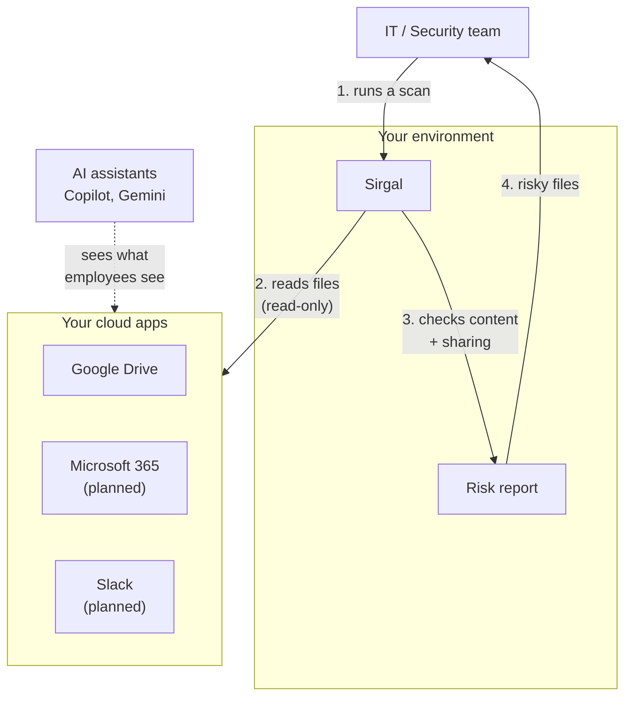

# Sirgal

**Find sensitive files your AI assistant can see before your employees do.**

> Sirgal is in early development, and I'm building it in public. Version 0.1.0 scans Google Drive for overshared files that contain sensitive data. Microsoft 365 support is planned.

## The problem

Microsoft Copilot and Google Gemini can read every file an employee has access to. In most companies, years of careless sharing means that's far more than it should be: a salary sheet shared with the whole company back in 2019, a customer list in a folder anyone with the link can open, a passwords file someone forgot about.

Before AI assistants, nobody stumbled on these files. Now anyone can ask "what does my manager earn?" and get an answer.

## What Sirgal does

Sirgal connects to your company's cloud storage, checks every file, and looks for two things: sensitive content (salaries, ID numbers, card numbers, passwords) and sharing that's too wide. When both show up in the same file, Sirgal flags it in a report so you can fix it before you switch on an AI assistant.

A real scan of the fake test company that ships with the project:

```
$ sirgal scan --source gdrive

RISK    SHARED WITH            FILE                                     FOUND
HIGH    anyone with the link   acme-robotics/HR/salaries_2026.csv       25 bank IBANs, salary data, 25 emails
HIGH    1 person               acme-robotics/HR/employee_records.csv    25 SSNs, dates of birth, 25 emails
HIGH    1 person               acme-robotics/IT/passwords.txt           6 passwords
OK      anyone with the link   acme-robotics/Marketing/blog_ideas.txt   -
OK      1 person               acme-robotics/General/team_lunch.txt     -
OK      private                acme-robotics/Sales/customers.csv        40 card numbers, 38 phone numbers, 40 emails

6 files scanned: 3 high risk, 3 ok.
File contents were read in memory and not saved.
```

The public blog post ideas are fine, and so is the customer list with card numbers, because only its owner can see it. The salary sheet that anyone with the link can open is not.

### What it checks

| Found in the file | How |
|---|---|
| Card numbers, bank IBANs | Pattern plus checksum (Luhn, mod-97), so random numbers don't count |
| US Social Security numbers, phone numbers, emails | Pattern |
| Salary data, dates of birth | Keyword plus matching numbers or dates |
| Passwords | Login keywords plus lines like `Stripe: user / secret` |

It reads plain text, CSV, Google Docs and Google Sheets (first sheet). Other file types, like PDF and Word, are listed as **UNKNOWN** when shared, never as OK, because Sirgal doesn't call a file safe without looking inside.

## How it fits together



## Who it's for

IT and security teams at small and mid-size companies getting ready to turn on Copilot or Gemini, and the IT providers (MSPs) who look after those companies.

## Security promises

Sirgal reads your files, so you should know exactly what it does with them.

- **Runs on your own machine or servers.** Your data never goes to me or any third party.
- **Read-only.** It asks Google for read-only access, so it can't change, delete or re-share anything. (A future opt-in "fix sharing" feature will ask for separate permission.)
- **Doesn't keep file contents.** Files are read in memory during a scan and discarded right after. Sirgal keeps only the file name, link, sharing settings, and the types of sensitive data found.
- **No AI services.** Detection runs locally. Nothing is sent to OpenAI, Google's AI, or anyone else.
- **Open source.** Every line of code is here for you to check.

## Roadmap

- [x] 0.0.1: package and command
- [x] Fake company data generator for safe demos
- [x] Google Drive connector
- [x] Sensitive data detection, layer 1: rules and checksums
- [ ] Sensitive data detection, layer 2: names and addresses with a local model
- [ ] PDF and Word files
- [ ] HTML report
- [ ] Microsoft 365 (OneDrive and SharePoint) connector
- [ ] Fix risky sharing (opt-in)
- [ ] Slack connector

## Quick start

Requires Python 3.10 or newer.

```
pip install sirgal
```

Sirgal talks to Google Drive with your own Google Cloud credentials, so no third-party app ever gets access. One-time setup, about 10 minutes:

1. In [Google Cloud Console](https://console.cloud.google.com), create a project (for example `sirgal`).
2. **APIs & Services → Library**, find **Google Drive API**, and click **Enable**.
3. **Google Auth Platform** (OAuth consent screen): fill in an app name and your email, then pick an audience.
   - Google Workspace: choose **Internal**.
   - Personal Gmail: choose **External**, then add your own address under **Audience → Test users**. Google asks you to log in again every 7 days in this mode.
4. **Clients → Create client → Desktop app**, then download the JSON file.
5. Save it as `~/.config/sirgal/credentials.json` and lock it down:

   ```
   mkdir -p ~/.config/sirgal
   mv ~/Downloads/client_secret_*.json ~/.config/sirgal/credentials.json
   chmod 600 ~/.config/sirgal/credentials.json
   ```

Then run a scan:

```
sirgal scan --source gdrive
```

The first time, your browser opens so you can approve read-only access. Sirgal saves the login token next to `credentials.json`, readable only by your user. To log out, delete `~/.config/sirgal/gdrive-token.json`.

Sirgal currently scans files owned by the account you log in with.

## Development

```
git clone https://github.com/bilalkumrani/sirgal.git
cd sirgal
python3 -m venv .venv && source .venv/bin/activate
pip install -e ".[dev]"
pytest
```

`python3 scripts/make_test_data.py` creates the fake Acme Robotics files in `test-data/`. Upload them to a test Google account to try a real scan without touching real data.

## Follow along

I post progress, design decisions, and the problems I run into on LinkedIn. [Follow me there](https://linkedin.com/in/bilalkumrani/).

## License

Apache 2.0. See [LICENSE](LICENSE).